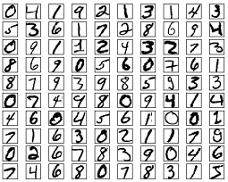
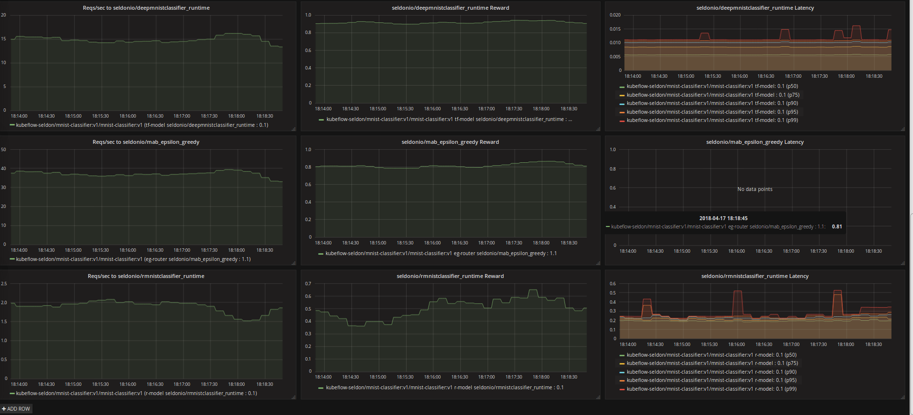

# Train and Deploy Machine Learning Models on Kubernetes with Kubeflow and Seldon-Core

Using:

 * [kubeflow](https://github.com/kubeflow/kubeflow)
 * [seldon-core](https://github.com/SeldonIO/seldon-core)
 
The example will be the MNIST handwritten digit classification task. We will train 3 different models to solve this task:

 * A TensorFlow neural network model.
 * A scikit-learn random forest model.
 * An R least squares model.

We will then show various rolling deployments

 1. Deploy the single Tensorflow model.
 2. Do a rolling update to an AB test of the Tensorflow model and the sklearn model.
 3. Do a rolling update to a Multi-armed Bandit over all 3 models to direct traffic in real time to the best model.

In the follow we will:

 1. [Install kubeflow and seldon-core on a kubernetes cluster](#setup)
 1. [Train the models](#train-the-models)
 1. [Serve the models](#serve-the-models)

# Setup

Either :

 1. Follow the [kubeflow](https://github.com/kubeflow/kubeflow/blob/master/user_guide.md) docs to 
    1. Create a [persistent disk for NFS](https://github.com/kubeflow/kubeflow/blob/master/user_guide.md#advanced-customization). Call it nfs-1. 
    1. Install kubeflow with an [NFS volume](https://github.com/kubeflow/kubeflow/blob/master/user_guide.md#advanced-customization), Argo and [seldon-core](https://github.com/kubeflow/kubeflow/blob/master/user_guide.md#serve-a-model-using-seldon) onto your cluster.
 1. [Follow a consolidated guide to do the steps in 1](setup.md).

# MNIST models

## Tensorflow Model

 * [Python training code](models/tf_mnist/train/create_model.py)
 * [Python runtime prediction code](models/tf_mnist/runtime/DeepMnist.py)
 * [Script to create wrap runtime prediction code to run under seldon-Core](models/tf_mnist/runtime/wrap.sh) using [Source-to-Image](https://github.com/openshift/source-to-image).

## SKLearn Model

 * [Python training code](models/sk_mnist/train/create_model.py)
 * [Python runtime prediction code](models/sk_mnist/runtime/SkMnist.py)
 * [Script to create wrap runtime prediction code to run under seldon-Core](models/sk_mnist/runtime/wrap.sh) using [Source-to-Image](https://github.com/openshift/source-to-image).

## R Model

 * [R training code](models/r_mnist/train/train.R)
 * [R runtime prediction code](models/r_mnist/runtime/mnist.R)
 * [Script to create wrap runtime prediction code to run under seldon-Core](models/r_mnist/runtime/wrap.sh) using [Source-to-Image](https://github.com/openshift/source-to-image).

# Train the Models

 Follow the steps in [./notebooks/training.ipynb](./notebooks/training.ipynb) to:

 * Run Argo Jobs for each model to:
   * Creating training images and push to repo
   * Run training
   * Create runtime prediction images and push to repo
   * Deploy individual runtime model

# Serve the Models

Follow the steps in [./notebooks/serving.ipynb](./notebooks/serving.ipynb) to:

 1. Deploy the single Tensorflow model.
 2. Do a rolling update to an AB test of the Tensorflow model and the sklearn model.
 3. Do a rolling update to a Multi-armed Bandit over all 3 models to direct traffic in real time to the best model.

If you have [installed the Seldon-Core analytics](setup.md#grafana-dashboard) you can view them on the grafana dashboard:

